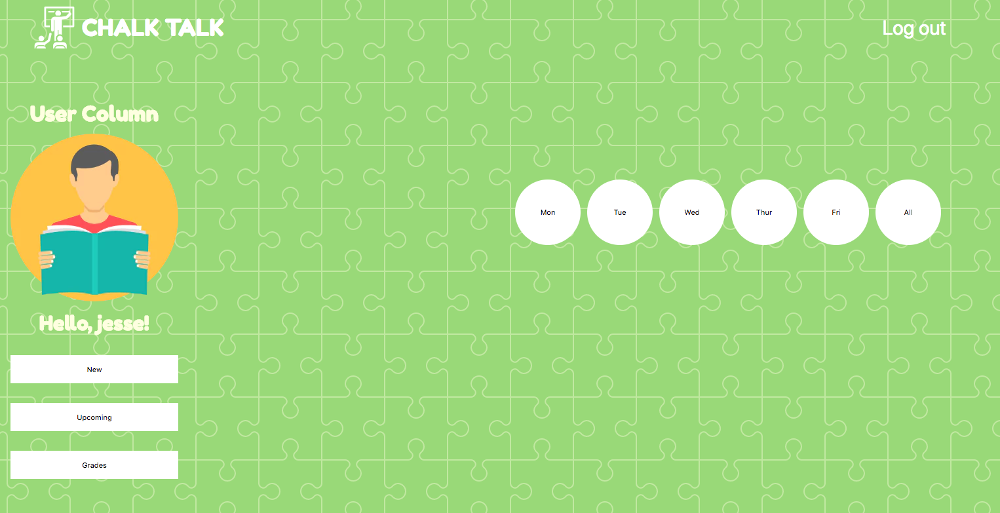
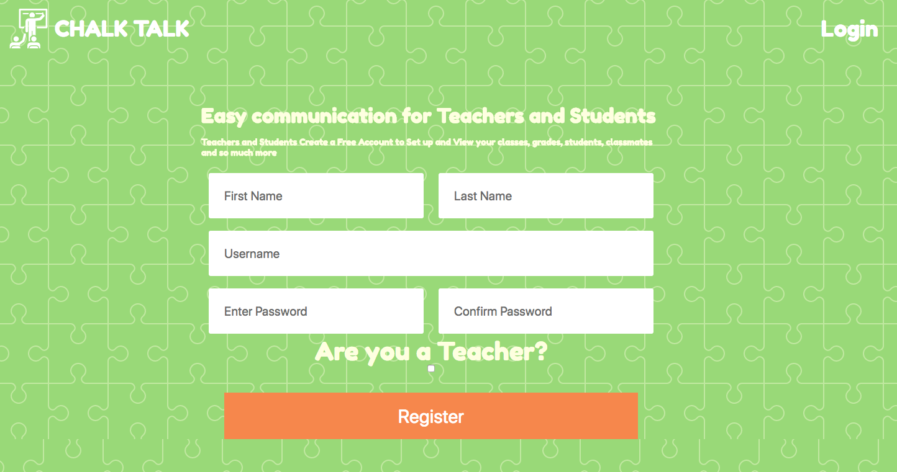

# LANGU UMBALA

https://boring-rosalind-f9b598.netlify.com/

## Screenshots

## Functional Specification

### Overview

Chalk Talk is a school management system for teachers and students.

Students can keep track of their grades and view upcoming assignments

Teachers can create new assignments and update grades to keep students (soon to be parents) in the loop

Non-Goals
This version will not support the following features:

* Parent Users
* Real time communication between students and teachers

#### Frontend

- Technologies: React, Redux, HTML5, CSS3, Responsive Web Design and SASS

#### Backend

- Technologies: Node.js, Express, MongoDB, Passport
- Allow users to register/login using local and jwt authentication
